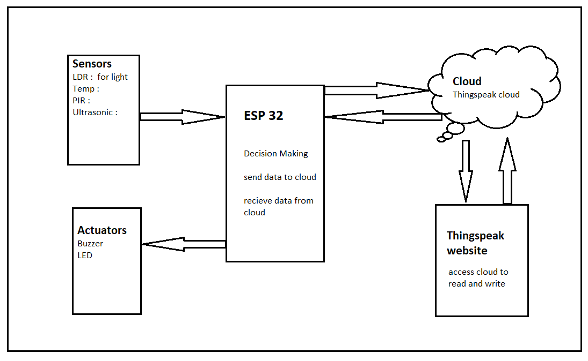

- ## Context: Smart Home Automation

  - Smart home appliances
  - IoT
  - Cloud Connectivity
  - Sensors

- ## Step 0: Ideation: 
  - Smart control of home appliances

  - Automatic as well as Manual Control of appliances over the network

  - Detection and prevention of threats using sensors and alert mechanism

  - Making user's life easier by controlling appliances remotely

  - Energy saving (switching off appliances when there is no human presence or when lights/fan is not required)

    

    

- ## Step 1: Selection of Processor

  - Espressif Systems **ESP32**

    

- ## Step 2: Sensors, Actuators & Networking Link

  - Parameters to measure : Sensors
    - Temperature and Humidity : **DHT11** (Vibhor)
    - Light Intensity Sensing : **LDR Sensor** (Vinayak)
    - Gas Leakage: **MQ2 / MQ35** (Zeba)
    - Human Presence Detection: **PIR Sensor** (Abhishek)
    - Count the Number of people: **UltraSonic Sensor** 
  - Actuators
    - For Alarming the user: **Buzzer**
    - **Relay:** Fan/light/other appliances on off state
    - PWM we can control light intensity (demo LED)
  - Network Link
    - Wifi Module inbuilt in ESP32

- ## Step 3: Cloud

  - Thingspeak Cloud
    - Single channel, Multiple fields
  - Localhost webserver
    - in case there is no internet

- ## Step 4: S/W Development

  - Programming separately for each sensor
  - 

- ## Step 5: 

