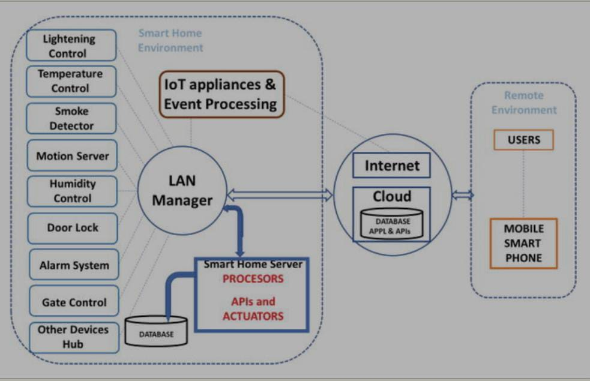

ZigBee technology :used for networking that is the object that are to be monitored and controlled.
Sensors:
1. Temperature sensor - >Used to measure temperature (freezers, oven etc).
2.Light sensor - >Used to adjust brightness (lamps).
3 Leakage sensor - >Used for water pipeline and gas leakage.
4.PIR - >Can be used in security alarms, motion detection and lighting applications.

ACTUATOR :For controlling and monitoring.

